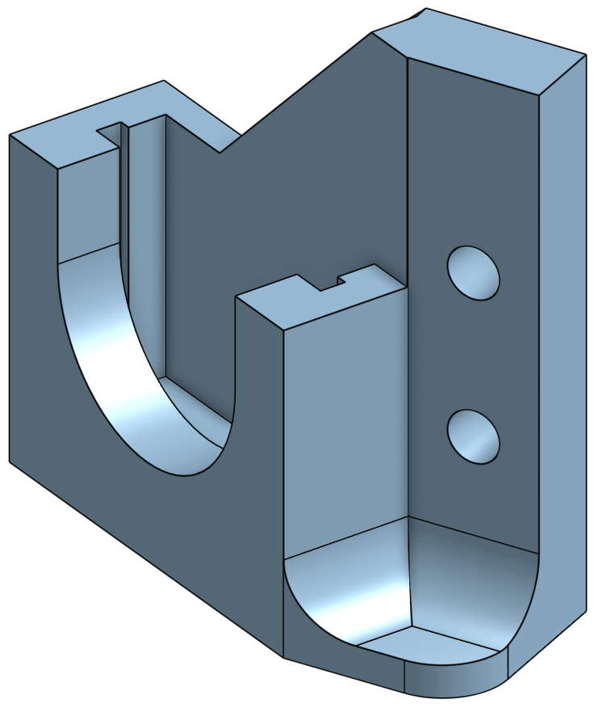
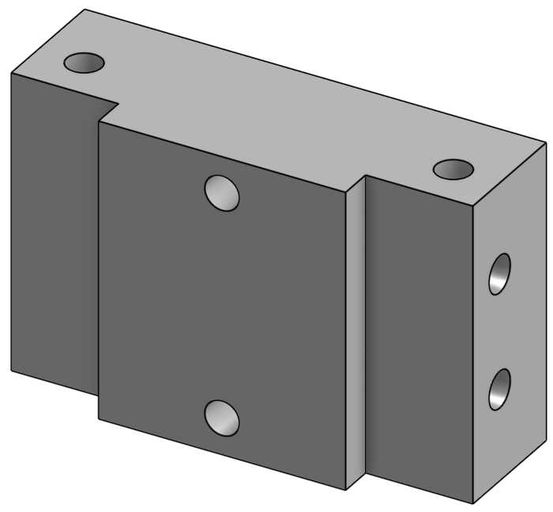
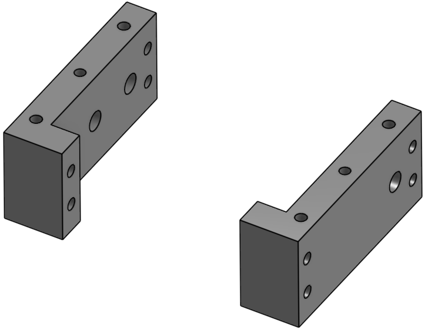
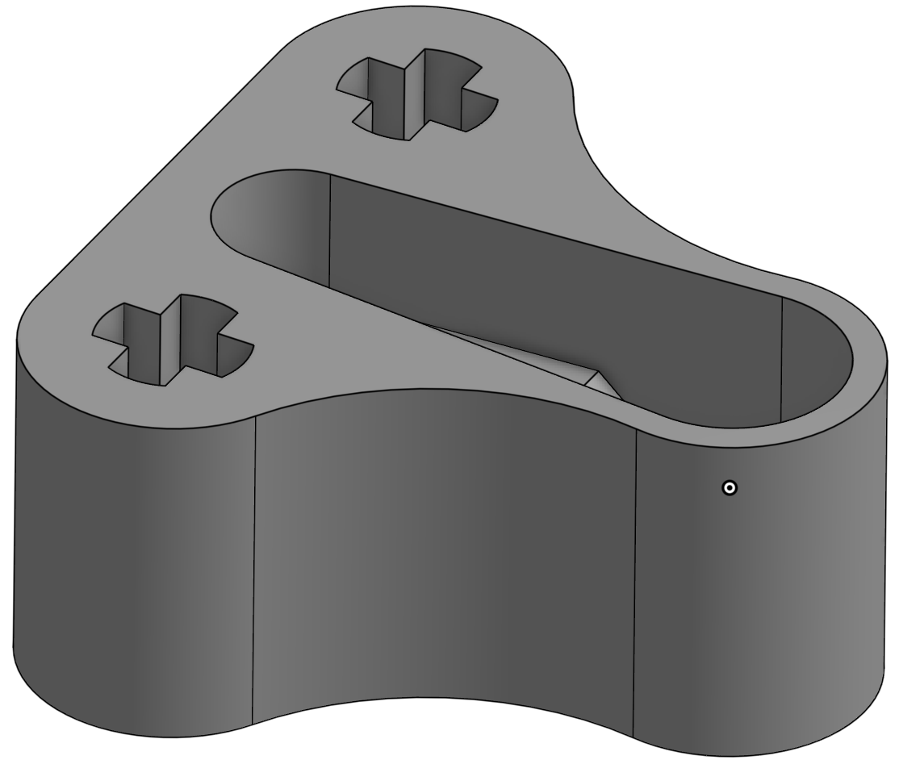
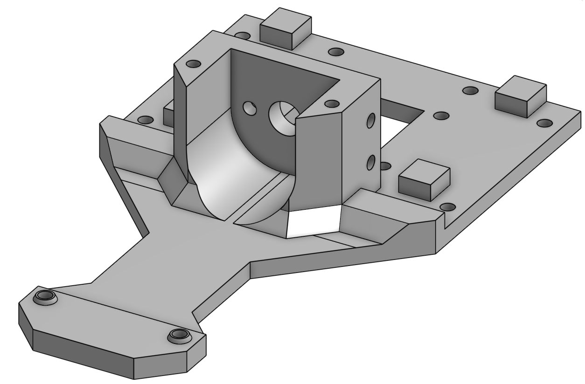
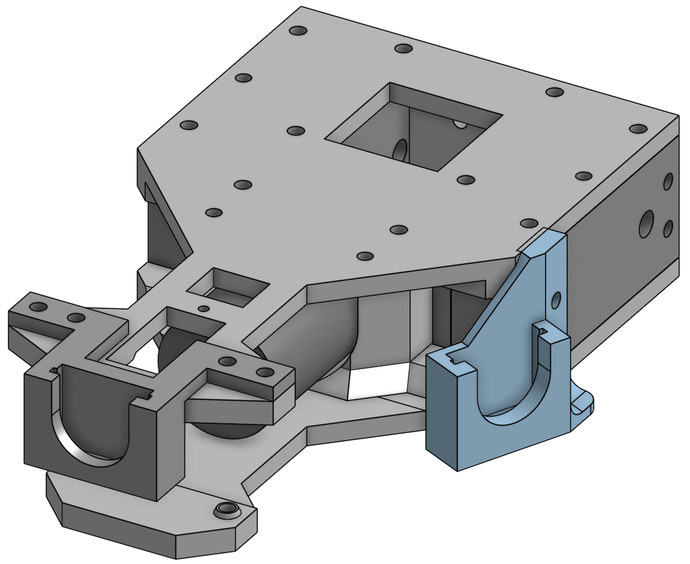
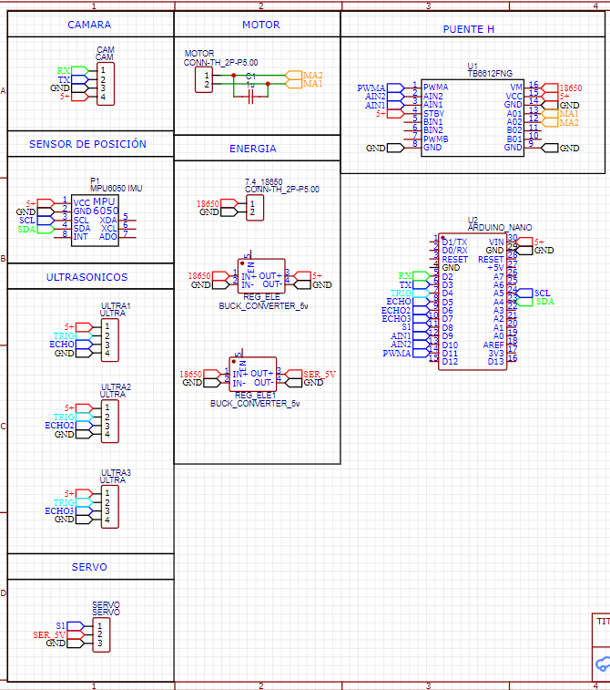
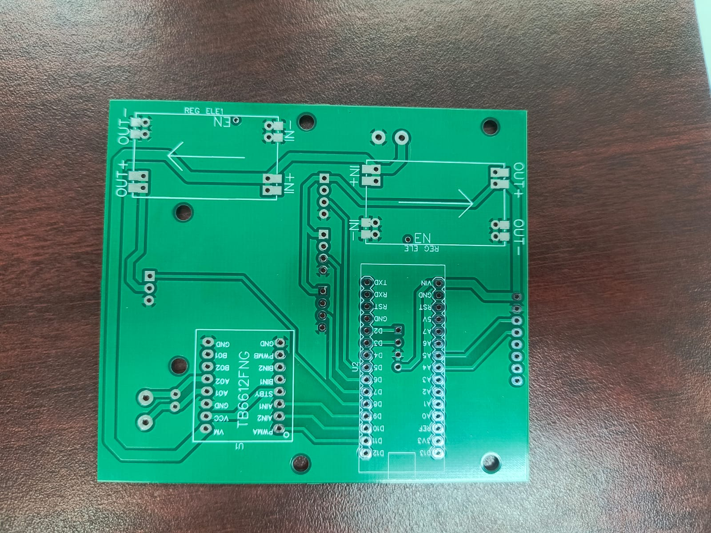

# WRO 2026 Future Engineers Superiores

## Team Members

<table align="center">
  <tr>
    <th colspan="2" align="left">
      Eduardo Alvarado González — Coach & Founder
    </th>
  </tr>
  <tr>
    <td width="260">
      
    </td>
    <td>
      <b>Age:</b> 40<br><br>
      I founded <b>Los Grises Superiores</b> in 2014 with the goal of creating a team where students could learn engineering through real competition experience. Over the years we have participated in multiple WRO and TMR events, reaching both national and international stages. This season I mainly support the team in project organization, technical guidance, and helping the students improve their engineering process during development.
    </td>
  </tr>
</table>

---

<table align="center">
  <tr>
    <th colspan="2" align="left">
      Christopher Pérez Cortés — Programming & Electronics
    </th>
  </tr>
  <tr>
    <td width="260">
      
    </td>
    <td>
      <b>Age:</b> 14<br><br>
      I joined the robotics club this year after taking an intensive robotics course, and since then I have been learning a lot about electronics, Arduino programming, and 3D design in Onshape. In the team I mainly work on the robot code, sensor integration, and electronics. WRO 2026 is my first international robotics competition, so this season has been a big learning experience for me.
    </td>
  </tr>
</table>

---

<table align="center">
  <tr>
    <th colspan="2" align="left">
      Bárbara Daiana García Balboa — Design & Assembly
    </th>
  </tr>
  <tr>
    <td width="260">
      
    </td>
    <td>
      <b>Age:</b> 13<br><br>
      I joined the robotics club a few months ago after completing two robotics courses. My main role in the team is helping with the mechanical design, chassis assembly, and testing different structural ideas for the robot. This is my first robotics competition, so I have been learning how the engineering and competition process works while building the project together as a team.
    </td>
  </tr>
</table>

---

<table align="center">
  <tr>
    <th colspan="2" align="left">
      Paulina Ibarra Martínez — Design & Construction
    </th>
  </tr>
  <tr>
    <td width="260">
      
    </td>
    <td>
      <b>Age:</b> 21<br><br>
      I have participated in robotics competitions for several years, including two Mexican Robotics Tournaments and previous WRO and TMR seasons as both competitor and junior coach. This year I support the team mainly in structural design, robot construction, and mentoring the newer members during development and testing. I also help organize ideas and improve the reliability of the robot during iterations.
    </td>
  </tr>
</table>

---


## Project Overview & Abstract

This project was developed as the evolution of our 2025 WRO Future Engineers robot, which successfully reached the international final. Based on the experience gained during that season, the entire vehicle was redesigned for 2026 using a fully 3D-printed chassis, an OpenMV H7 camera, and an Arduino Nano-based control system to improve stability, adaptability, and overall performance.

The robot was built to autonomously complete the two Future Engineers challenges established by the WRO 2026 rules. During the Open Challenge, the vehicle must complete three laps while adapting to randomized track conditions such as driving direction, starting position, and corridor width. In the Obstacle Challenge, the robot must detect colored traffic pillars, avoid them from the correct side, and finally perform a parallel parking maneuver inside the designated parking zone.

Throughout the development process, the team continuously tested and improved both the mechanical and software systems in order to adapt the robot to the new 2026 rule changes and achieve more reliable autonomous behavior.

### Chassis Design & Iteration

Our first robot designs were based on a LEGO Mindstorms EV3 chassis. While it was easy to build and modify, we noticed several limitations during testing, especially related to weight, space distribution, and steering precision. The EV3 structure was also too restrictive for the type of custom design we wanted to achieve for the 2026 season.

Because of this, we decided to redesign the entire chassis using fully 3D-printed parts designed in Onshape. Our main goal was to create a lighter and more compact structure while still following the WRO size and weight regulations. We also wanted to improve stability, steering performance, and sensor placement.

Throughout the season, we tested different chassis versions. The first prototype used a flat structure, but during steering tests we discovered that the chassis flexed when the servo applied force, causing inaccurate steering movements. To improve rigidity, we redesigned the structure by adding reinforced supports and increasing the wall thickness in critical areas.

Later, we developed a third version focused on improving cornering performance in the new 600 mm corridor introduced in the 2026 rules. We reduced the overall length of the robot and relocated some electronic components to lower the center of gravity and improve balance while turning.

During the final reprint of the chassis using grey PLA filament, we encountered an unexpected problem: the drivetrain became stuck even though the motor was working correctly. After inspecting the structure, we realized that the new filament produced slightly tighter tolerances, causing friction around the rear axle housing. To solve this, we manually sanded the affected area until the shaft rotated smoothly again. After this issue, we started checking all moving parts after every print before assembling the robot.

### Steering System

For the steering system, we decided to use an Ackermann-style configuration combined with a rack-and-pinion mechanism integrated into the front section of the chassis. The steering structure uses a LEGO Technic rack connected to a servo motor, allowing the robot to perform smooth and consistent turns during autonomous navigation.

At the beginning of the season, we tested the robot using a standard SG90 micro servo. Although it worked during basic movement tests, we started noticing problems once the robot began making constant steering corrections at higher speeds. The servo occasionally responded inconsistently and showed signs of wear after repeated testing sessions.

To improve reliability, we replaced the SG90 with a Steren MOT-110 micro servo, which provided better torque consistency and more stable steering performance during continuous correction cycles. Since both servos used the same control interface, we were able to keep the same software structure without major code modifications.

We chose an Ackermann-style steering geometry because it allows the front wheels to follow different turning radii during corners, reducing wheel friction and improving turning precision. This became especially important while testing the robot in tighter sections of the WRO track.

However, implementing a full Ackermann geometry would have required a wider front axle, potentially exceeding the maximum width allowed by the competition rules. Because of this, we decided to use a simplified version that still improved steering behavior while keeping the design compact and easier to manufacture.

## Vehicle Photos

<div align="center">

| Front | Back |
|:--:|:--:|
|  |  |

| Top | Bottom |
|:--:|:--:|
|  |  |

| Left | Right |
|:--:|:--:|
|  |  |


# LEGO Set Use

| BLItemNo | ElementId | LdrawId | Part Name | BLColorId | LDrawColorId | Color Name | Qty | Weight (g) | Price per piece (USD) | Total (USD) |
|----------|------------|----------|------------|------------|----------------|-------------|-----|--------------|-------------------------|---------------|
| 6589 | 4565452 | 6589.dat | Technic Gear 12 Tooth Bevel | 19 | 19 | Tan | 3 | 0.40 | 0.15 | 0.45 |
| 3713 | 6275844 | 3713.dat | Technic Bush | 86 | 7 | Light Bluish Gray | 6 | 0.20 | 0.05 | 0.30 |
| 32523 | 4142822 | 32523.dat | Technic Liftarm 1 x 3 | 11 | 0 | Black | 2 | 0.80 | 0.20 | 0.40 |
| 39367pb01 | 6460453 | 39367.dat | Wheel 56 x 14 Technic | 102 | 9 | Blue | 4 | 5.50 | 1.50 | 6.00 |
| 62821b | — | 62821.dat | Technic Differential Gear (Closed) | 85 | 8 | Dark Bluish Gray | 1 | 3.50 | 3.50 | 3.50 |
| 87083 | 6083620 | 87083.dat | Technic Axle 4L with Stop | 85 | 8 | Dark Bluish Gray | 4 | 0.60 | 0.10 | 0.40 |
| 94925 | 4640536 | 94925.dat | Technic Gear 16 Tooth | 86 | 7 | Light Bluish Gray | 4 | 0.50 | 0.20 | 0.80 |
| 43093 | — | 43093.dat | Technic Axle 1L with Pin | 102 | 9 | Blue | 2 | 0.30 | 0.15 | 0.30 |
| 43093 | — | 43093.dat | Technic Axle 1L with Pin | 19 | 19 | Tan | 2 | 0.30 | 0.15 | 0.30 |
| 48989 | 6282158 | 48989.dat | Technic Pin Connector Perpendicular 3L | 86 | 7 | Light Bluish Gray | 2 | 1.00 | 0.30 | 0.60 |
| 40490 | 4645732 | 40490.dat | Technic Liftarm 1 x 9 | 15 | 15 | White | 1 | 1.20 | 0.50 | 0.50 |
| 32523 | 4142822 | 32523.dat | Technic Liftarm 1 x 3 | 11 | 0 | Black | 2 | 0.80 | 0.20 | 0.40 |
| 4265c | 6271167 | 4265c.dat | Technic Bush 1/2 Smooth | 3 | 14 | Yellow | 2 | 0.10 | 0.10 | 0.20 |

| TOTAL PARTS | TOTAL WEIGHT |
|--------------|----------------|
| 35 | 39.2 g |


### Traction System

For the traction system, we decided to use a rear-wheel drive configuration powered by a DC motor with an integrated gearbox connected to a TB6612FNG motor driver. Both rear wheels are connected through the same drivetrain, which helped us keep the system simpler, lighter, and fully compliant with the WRO rules.

During testing, we experimented with different gear ratios to find the best balance between speed and control. Some configurations made the robot extremely fast, but that also reduced the reaction time when detecting obstacles or correcting direction. Other configurations improved stability but made the robot too slow during acceleration.

After multiple test sessions, we found that an approximate 1:30 gear ratio gave us the best overall performance for both challenges.

| Parameter | Value |
|---|---|
| Drive motor | DC motor with gearbox |
| Motor driver | TB6612FNG dual H-bridge |
| Drive system | Rear-wheel drive |
| Wheel configuration | Both rear wheels connected together |
| Selected gear ratio | Approx. 1:30 |

---

### Speed Testing

| PWM Value | Approx. Speed | Main Use |
|---|---|---|
| 110 | ~0.28 m/s | Narrow corridor and obstacle sections |
| 130 | ~0.36 m/s | Normal track navigation |
| 150 | ~0.44 m/s | Open straight sections |

---

### Gear Ratio Comparison

| Gear Ratio | What Happened |
|---|---|
| 1:20 | The robot became too fast and reacted late to obstacles |
| 1:50 | Acceleration became too slow for completing laps efficiently |
| 1:30 | Best balance between speed, control, and stability |

#### Mechanical Trade-offs & Decisions

During the development process, we tested different ideas and components before deciding on the final configuration of the robot. In several cases, we had to choose between simplicity, performance, reliability, and compliance with the WRO rules.

| System | Option We Chose | Option We Rejected | Why We Chose It |
|---|---|---|---|
| Chassis material | 3D-printed PLA | LEGO Technic | Allowed us to create custom shapes while reducing overall weight |
| Steering system | Servo + rack mechanism | Differential steering | More stable and compliant with WRO steering rules |
| Drive system | Single DC motor | Two coupled motors | Simpler wiring, lighter structure, and easier control |
| Vision system | OpenMV H7 (UART) | HuskyLens (I2C) | OpenMV provided faster and more stable data during movement |

One of the most important decisions was replacing the HuskyLens camera with the OpenMV H7. During testing, we noticed that the HuskyLens sometimes sent data too slowly, which caused unstable steering corrections and servo oscillation. After switching back to the OpenMV system, the robot behaved much more smoothly and consistently during autonomous navigation.**

---
####  Structural Components (3D Design)

<div align="center">

| Central Sensor Mount | Side Sensor Mounts | Rear Support |
|:--:|:--:|:--:|
|  |  |  |

| External Supports | Internal Supports | Directional Module |
|:--:|:--:|:--:|
|  |  |  |

| Lower Body | Upper Body | Full Base Structure |
|:--:|:--:|:--:|
|  |  |  |

</div>

---

####  Main Chassis Structure

<div align="center">

| Lower Body | Upper Body |
|:--:|:--:|
|  |  |

</div>
---

####  Complete Aseembly

<div align="center">

| Full Base Structure |
|:--:|
|  |

</div>

---

####  Steering Component

<div align="center">

| Directional Module |
|:--:|
|  |

</div>
---

###  PCB & Wiring Implementation (changes to edit later)

<div align="center">

| PCB Design | PCB Schematic | Real PCB |
|:--:|:--:|:--:|
|  |  |  |


## Source Code

Full source code available in `src/`

Our robot is controlled using an Arduino Nano, where we manage sensor reading, steering control, obstacle reactions, and movement decisions. Throughout the season, we continuously tested and adjusted the code to improve stability and response time during both challenges.

Some of the main functions implemented in our code include:

- Ultrasonic-based wall navigation
- IMU yaw tracking and lap counting
- OpenMV color detection for red and green pillars
- Obstacle avoidance logic
- Parking sequence development

---

# Criterion 2 — Power & Sensor Architecture

## Power System & Budget

To power the robot, we use two Steren Li-ion 3.7V batteries connected in series, providing a total of 7.4V. We separated the power system into two rails: one dedicated to the electronic components and another one for the motor system. This helped us reduce electrical noise and achieve more stable sensor readings during movement.

| Rail | Components Powered | Estimated Consumption |
|---|---|---|
| 5V Logic Rail | Arduino Nano, MPU6050, OpenMV H7, HC-SR04 sensors | ~600 mA |
| Motor Rail | TB6612FNG + DC motor | ~1.5 A |

We used a Mini 560 step-down regulator to provide a stable 5V supply for the electronic components. During testing, this configuration proved reliable even when the motor rapidly changed speed.

One issue we considered was battery voltage drop during long testing sessions. When the voltage became too low, the robot started losing motor performance and sensor stability. Because of this, we added a small digital voltmeter directly on the chassis to monitor battery voltage before every run.

---

### Power Consumption

| Component | Approx. Current |
|---|---|
| Arduino Nano | 20 mA |
| MPU6050 | 3.9 mA |
| OpenMV H7 | ~280 mA |
| HC-SR04 ×3 | ~45 mA |
| Steering Servo | ~200 mA |
| DC Motor | 800–1500 mA |

---

## Wiring Diagram

Full wiring diagrams available in `schemes/`

The electrical system was designed to keep the wiring as organized and compact as possible inside the chassis. Most components are connected directly to the Arduino Nano and distributed through the PCB designed by the team.

### Main Connections

| Component | Connection |
|---|---|
| MPU6050 | SDA → A4 / SCL → A5 |
| OpenMV H7 | UART TX/RX |
| Front Ultrasonic | TRIG → D7 / ECHO → D6 |
| Left Ultrasonic | TRIG → D3 / ECHO → D2 |
| Right Ultrasonic | TRIG → D5 / ECHO → D4 |
| DC Motor Driver | AIN1 → D10 / AIN2 → D11 / PWMA → D9 |
| Steering Servo | Signal → D8 |

The MPU6050 communicates through I2C, while the OpenMV camera uses UART communication. This allowed us to keep the I2C bus dedicated only to the IMU and helped improve communication stability between modules.

## PCB & Iteration Problems

To keep the internal wiring cleaner and more organized, we designed a custom PCB to centralize all the electrical connections inside the robot. Compared to direct wiring, this helped us reduce cable clutter, simplify debugging, and improve overall reliability during movement.

However, during the first PCB assembly, we encountered an important problem. After soldering all the components, the ultrasonic sensors started returning unstable and inconsistent distance values, even while the robot was completely stationary.

After inspecting the board, we discovered that excess solder had accidentally created small bridges between nearby PCB traces, causing interference between the TRIG and ECHO signals of different sensors.

To solve this, we carefully removed the excess solder using desoldering braid and re-soldered the affected areas with better control. Once the PCB was cleaned, the sensor readings became stable again and the issue disappeared completely.

Although this problem delayed part of the testing process, it helped us improve both the electrical reliability of the robot and our soldering precision for future iterations.

---

## Sensor Selection & Placement

### HC-SR04 Ultrasonic Sensors

We use three HC-SR04 ultrasonic sensors to detect walls and measure distances around the robot during navigation.

| Sensor | Position | Purpose |
|---|---|---|
| Front | Front center | Detect walls and corners ahead |
| Left | Left side | Measure distance to side walls |
| Right | Right side | Measure distance to side walls |

We chose ultrasonic sensors instead of infrared sensors because the WRO walls are matte black, which can produce unreliable IR readings. Ultrasonic sensors provided more stable measurements regardless of surface color.

During assembly, we positioned the sensors close to wheel height to reduce false floor detections while turning. We also noticed that at higher speeds the sensors occasionally produced noisy readings, so we implemented filtering in software to smooth sudden spikes.

---

### MPU6050 IMU

The MPU6050 is used mainly for yaw tracking and orientation correction. We use the gyroscope data to count turns, detect drift, and calculate completed laps during autonomous navigation.

Some of the main functions of the IMU in our robot are:

- Counting 90° turns
- Correcting drift on straight sections
- Determining lap completion through accumulated yaw

Before every run, the robot performs a short calibration process while remaining completely still. This allows the IMU to calculate sensor offsets and improve accuracy during movement.

---

### Camera — OpenMV H7

For vision processing, we currently use an OpenMV H7 camera connected through UART communication.

| Parameter | Value |
|---|---|
| Resolution | 320 × 240 px |
| Communication | UART (115200 baud) |
| Detection Mode | Color blob tracking |
| Objects Detected | Red and green pillars |
| Frame Rate | ~30 FPS |
| Camera Position | Front-center, tilted downward |

At the beginning of the season, we originally planned to use a HuskyLens camera because it was easier to integrate and already included built-in object detection features. However, during testing we discovered that the HuskyLens was sending data too slowly for our steering system.

Because the Arduino was not receiving continuous detection updates, the steering servo started oscillating and the robot moved inconsistently during straight sections.

To solve this problem, we switched back to the OpenMV H7 platform that we had already used during the 2025 season. Using a custom MicroPython script, the OpenMV continuously sends detection data to the Arduino through UART communication, resulting in much smoother and more stable steering behavior.

Although the OpenMV required more programming and communication handling, the improvement in reliability and response time made the change completely worth it.

After several tests, we also found that mounting the camera with a slight downward angle produced the best detection results without capturing too much of the floor or reducing detection range.

## Calibration Methods

Before testing or competing, we calibrate different parts of the robot to make sure everything works consistently on the track.

| Component | How We Calibrate It | When |
|---|---|---|
| MPU6050 | Using `calcOffsets()` while the robot stays still | Before every run |
| OpenMV H7 | Adjusting LAB color thresholds in OpenMV IDE | Before testing and competitions |
| HC-SR04 Sensors | Comparing readings with real measured distances | During testing |
| Steering Servo | Adjusting the steering center value manually | After rebuilding or modifying the chassis |

These calibration steps helped us improve steering accuracy, sensor stability, and overall consistency during autonomous runs.

---

# Criterion 3 — Software Architecture & Obstacle Strategy

## System Overview

Our entire control system runs on a single Arduino Nano. All the sensor reading, steering corrections, obstacle detection, and movement decisions happen inside the same main loop.

Instead of using multiple processors, we decided to keep everything on one controller because it made the robot easier to debug, modify, and test throughout the season. After several iterations, this setup gave us stable performance and fast enough response times for both challenges.

To keep the code organized, we divided the program into different modules.

| Module | Main Functions | What It Does |
|---|---|---|
| IMU | `actualizarIMU()` | Tracks robot rotation and yaw |
| Ultrasonics | `medirDistancia()` | Measures wall distances |
| Lateral Control | Steering correction logic | Keeps the robot centered |
| OpenMV | `parseOpenMV()` | Receives obstacle detection data |
| Drive | `avanzar()`, `girarSuave()` | Controls movement and steering |
| Start Sequence | `faseInicio` | Handles startup alignment |

---

## State Machine

To organize the robot behavior, we created different operating states depending on what the robot detects during the run.

| State | Purpose |
|---|---|
| START | Initial alignment before moving |
| LANE_FOLLOW | Normal navigation and wall following |
| AVOID_COLOR | Obstacle avoidance using camera detection |
| EMERGENCY | Collision prevention and recovery |
| STOP | End of the run after completing laps |

The robot constantly switches between these states depending on sensor readings and track conditions. Emergency actions always have the highest priority to avoid crashes.

---

## Open Challenge Algorithm

At the start of every run, we initialize all the sensors, calibrate the IMU, and wait for the start button. Once the run begins, the robot continuously reads wall distances, updates orientation data, and adjusts steering depending on the track conditions.

We also implemented adaptive speed control. In narrow sections, the robot slows down to improve stability and avoid collisions. In wider sections, it increases speed to complete laps more efficiently.

For lap counting, we use the MPU6050 gyroscope. Every detected 90° turn increases the accumulated yaw value until reaching the equivalent of three complete laps. Once that value is reached, the robot stops automatically.

This method allowed us to make the lap counting system work correctly in both clockwise and counterclockwise runs without needing separate logic for each direction.

## Vision Processing Strategy (ROIs)

We noticed that using the full camera image caused a lot of unstable detections. Reflections from the floor, random objects, and unnecessary data sometimes made the robot react too late or steer incorrectly.

To solve this, we divided the image into different Regions of Interest (ROIs), so the OpenMV only focuses on the most important parts of the frame.

## ROI	Purpose
Upper ROI	Detect pillars early and prepare the turn
Middle ROI	Main decision area for obstacle avoidance
Lower ROI	Ignore floor reflections and false detections

When multiple objects appear, we select the largest blob because it is usually the closest obstacle. We also added a small delay (~300 ms) to avoid repeated detections during turns.

This strategy made the robot much more stable and predictable during testing. Instead of improving the camera itself, we improved how the information was processed, which reduced false positives and gave us faster and smoother reactions.

## Parking Strategy

After finishing the 3 laps in the Obstacle Challenge, our robot performs a parallel parking maneuver inside the magenta parking zone. The system is still being refined, but our current strategy focuses more on reliability and consistency than speed.

To detect the parking area, we mainly use the HC-SR04 ultrasonic sensors. We look for a larger side gap and less obstruction in front of the robot. The OpenMV H7 can also help identify the parking area if visual references are available.

The maneuver is divided into three phases:

| Phase | Description |
|---|---|
| Alignment | Position the robot parallel to the parking zone |
| Entry | Turn smoothly into the parking space |
| Correction | Make small adjustments until centered |

During testing, we found several challenges:

- Limited parking space
- Ultrasonic noise at short distances
- Need for precise steering timing

To improve consistency, we reduced the parking speed and combined fixed steering sequences with sensor feedback. Right now, our goal is making the maneuver stable and repeatable instead of extremely fast.

Future updates will include better parking detection and more dynamic corrections before the final competition.

---

## Lateral Control Strategy

Instead of using a full PID controller, we decided to use a simpler threshold-based control system combined with IMU correction. This made the robot easier to tune and more stable on the Arduino Nano.

The robot constantly compares the left and right ultrasonic distances:

```cpp
error = distL - distR;

If the robot gets too close to one wall, we automatically correct the steering toward the opposite side to keep the robot centered.

To reduce sensor noise from the HC-SR04 sensors, we added exponential smoothing:

```cpp
suavizado = (suavizado * 0.7f) + (error * 0.3f);
```

For straight sections, the MPU6050 helps us correct small drifting errors using gyro feedback. This became especially important in the 1000 mm corridor, where long straight sections make drift more noticeable.

After many tests, we tuned the control constants to reduce oscillation while still keeping fast reactions near corners.

| Constant | Value |
|-----------|--------|
| Kp | 2.5 |
| Ki | 0.01 |
| Kd | 1.2 |

We started with a low proportional gain and gradually increased it until the robot began oscillating. Then we reduced it slightly and added derivative damping to make the steering smoother and more stable.

---

# Testing & Tuning

| Test | Result | Adjustment |
|------|---------|-------------|
| Open Challenge (wide corridor) | 18/20 successful runs | — |
| Open Challenge (narrow corridor) | 14/20 successful runs | Reduced speed to PWM 110 |
| Obstacle avoidance | 17/20 correct detections | Increased detection timeout |
| IMU lap counting | 20/20 correct | — |
| Startup alignment | 19/20 centered correctly | Improved alignment gain |

Most of our tuning focused on making the robot more stable under different corridor sizes and lighting conditions.

## Problems & Iterations

During the development of our robot, we faced several problems related to mechanics, electronics, and software.  
Instead of ignoring them, we used each issue as an opportunity to improve the robot and better understand how every part of the system behaves in real conditions.

| Problem | Impact | Solution |
|----------|--------|----------|
| Excessive dimensions in the original LEGO chassis | The robot struggled in tight curves and narrow sections | We redesigned the structure and moved to a more compact and lightweight 3D-printed chassis |
| Signal instability in sensors | We noticed inconsistent wall detection and unstable trajectory corrections | We created a custom PCB and improved the soldering quality to reduce electrical noise and improve reliability |
| Limitations in simultaneous color detection | Sometimes the robot reacted incorrectly to obstacles | We optimized the OpenMV firmware and improved the AI processing logic for more stable detections |
| Insufficient internal space for components | Organizing the electronics and wiring became difficult inside the chassis | We slightly increased the chassis length to create more internal space and improve cable management |

# Evolution From 2025 to 2026

Our 2026 robot is not just a small upgrade from the 2025 version. We rebuilt almost the entire system based on everything we learned during the international competition.

| System | 2025 | 2026 Final |
|--------|------|-------------|
| Chassis | LEGO Technic | Custom 3D-printed PLA |
| Vision | OpenMV H7 | OpenMV H7 |
| Controller | EV3 Brick | Arduino Nano |
| Steering | EV3 motor | Steren MOT-110 servo |
| Weight | ~1.2 kg | ~0.7 kg |

One of the biggest changes happened mid-season when we replaced the HuskyLens with the OpenMV H7 again. During testing, the HuskyLens was not sending enough continuous data, causing the steering servo to oscillate. Switching back to OpenMV solved the issue and gave us much smoother and more stable control.

---

# Engineering Decisions & Trade-offs

Throughout development, we constantly balanced simplicity, reliability, and performance.

| Decision | Why we chose it |
|----------|-----------------|
| Arduino Nano instead of Raspberry Pi | Easier to debug and understand as a team |
| OpenMV instead of HuskyLens | More stable continuous data stream |
| Short wheelbase | Better turning radius in tight corridors |
| Threshold-based control | More predictable than a complex PID setup |

We focused on building a system that every team member could fully understand and maintain instead of relying on overly complex solutions.

---

# Risk Analysis

| Risk | Mitigation |
|------|-------------|
| IMU drift | Accumulated yaw tracking |
| Wrong color detection | Largest blob selection + timeout |
| Battery voltage drop | Voltmeter checks before runs |
| Wall collisions | Adaptive speed reduction |
| Servo drift | IMU correction on straight sections |

We also documented and solved several hardware problems during development, including PCB solder bridges and drivetrain binding after reprinting the chassis.

---

# Repository Structure

```text
WRO-2026-Future-Engineers/
├── README.md
├── src/
│   ├── open_challenge/
│   └── obstacle_challenge/
├── schemes/
├── models/
├── v-photos/
└── t-photos/
```

The repository includes the full Arduino code, wiring diagrams, PCB schematics, STL files, and robot photos so the entire project can be reproduced and improved in the future.

---

# Components & Cost

| Component | Qty |
|-----------|-----|
| OpenMV H7 | 1 |
| Arduino Nano | 1 |
| HC-SR04 | 3 |
| MPU6050 | 1 |
| TB6612FNG | 1 |
| Steren MOT-110 Servo | 1 |
| Li-ion Batteries | 2 |

**Estimated total cost: approximately 154 USD**


# In conclusion (●'◡'●)

This repository documents the complete development process of our WRO 2026 Future Engineers robot, from the first design concepts to the latest competition-ready version.

Throughout the season, we redesigned almost every part of the system based on testing, failures, and continuous improvements. The project includes a fully custom 3D-printed chassis, Arduino Nano control system, OpenMV H7 vision processing, ultrasonic navigation, IMU-based lap tracking, and obstacle avoidance strategies developed specifically for the 2026 rules.

Instead of focusing only on final results, this repository also documents the engineering decisions behind the robot, including hardware changes, software iterations, PCB problems, steering improvements, sensor calibration, and real testing data collected during development.

Our goal was to build a robot that is not only competitive, but also understandable, reliable, and fully developed by our team through experimentation and iteration.

This repository contains:
- Full Arduino source code
- Wiring diagrams and PCB schematics
- 3D models and printable STL files
- Robot photos and assembly references
- Engineering documentation and testing results
- Development history and design decisions

We hope this project can also help future teams learn more about robotics, engineering design, and autonomous vehicle development.

---

<div align="center">

# THANK YOU FOR READING (´▽｀)

### Thank you for taking the time to explore our project and follow our development process throughout the WRO 2026 season.

### We truly appreciate your time, interest, and support.

<br>

**Team Superiores**  
*WRO Future Engineers 2026*

</div>
